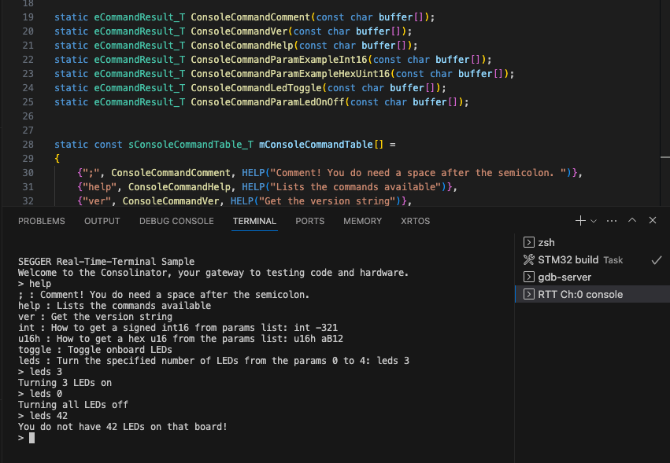

# Making Embedded Systems - Week 5

### Command Line Interface for STM32f407g-disc board

From https://github.com/eleciawhite/reusable 

On the STM32f407g-disc board, the Virtual COM port pins are not connected to the USART of the STM32F407 (Cf. User Manual UM1472, 6.1.3).

To avoid soldering wires to connect the ST-LINK/V2-A Virtual COM port pins to the STM32F407, I used SEGGER RTT (Real-Time Trace) https://wiki.segger.com/RTT and modified the wrapper Console IO (consoleIo.c).

Functions implemented:

- `toggle`: toggle onboard LEDs
- `leds` : turn on or off a specified number of LEDs, using a parameter.

